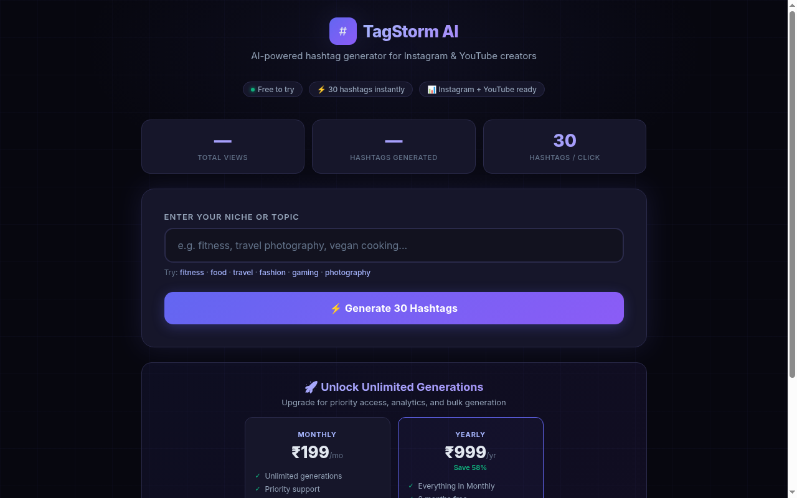

# ⚡ TagStorm: AI Hashtag Generator & Micro-SaaS Platform

[](https://www.python.org/)
[](https://flask.palletsprojects.com/)
[](https://www.sqlite.org/)
[](https://nginx.org/)
[](LICENSE)
[](https://pixelssudio.github.io/tagstorm-hashtag-saas/)

> **A turnkey, production-grade Micro-SaaS web application** for social media creators and agencies to generate viral hashtags, analyze competition difficulty, and optimize Instagram & YouTube reach. Ships with a complete frontend application, RESTful backend, SQLite analytics, production Nginx/Systemd configs, and a high-converting sales landing page.


<div align="center">
  <br/>
  
  <br/>
</div>

---


## 🌟 Features & Highlights

- 🎯 **Multi-Niche AI Categorization**: Tailored hashtag generation across 10+ core niches (Fitness, Travel, Food, Tech, Fashion, Gaming, Photography, Business, Lifestyle, Beauty) with semantic fallback matching.
- 📊 **Reach & Competition Scoring**: Algorithmic scoring evaluating estimated reach, engagement potential, and competition difficulty.
- 📋 **1-Click Smart Copy**: Copy all, top 10, or selected tags directly to clipboard formatted with hashtag prefixes.
- 📈 **Built-in Analytics Engine**: Tracks queries, trending keywords, and usage statistics in lightweight SQLite (`analytics.db`).
- 💰 **Pre-built Sales Landing Page**: Complete responsive sales page (`sales.html`) ready for Gumroad, LemonSqueezy, or Stripe payment link embedding.
- 🚀 **1-Click Linux VPS Deployment**: Ready-to-use `deploy.sh`, systemd service unit (`tagstorm.service`), and Nginx reverse proxy config (`nginx-hashtag-tool`).

---

## 🛠️ Tech Stack & Architecture

- **Backend**: Python, Flask, SQLite3
- **Frontend**: Modern HTML5, CSS3 Glassmorphism, Vanilla JS (zero framework overhead, ultra-fast load time)
- **Deployment**: Nginx, Gunicorn / systemd, Ubuntu/Debian compatible

---

## 🚀 Quick Start (Local Run)

### 1. Clone & Install Dependencies
```bash
git clone https://github.com/pixelssudio/tagstorm-hashtag-saas.git
cd tagstorm-hashtag-saas
pip install -r requirements.txt
```

### 2. Run Flask App
```bash
python app.py
```
Open **[http://localhost:5000](http://localhost:5000)** for the main hashtag generator tool.
Open **[http://localhost:5000/sales.html](http://localhost:5000/sales.html)** to preview the sales funnel page.

---

## 🌐 Production VPS Deployment

Deploying on Ubuntu/Debian with Nginx:
```bash
chmod +x deploy.sh
./deploy.sh
```
This automatically:
1. Provisions python virtualenv and installs requirements.
2. Registers and starts the `tagstorm.service` systemd daemon.
3. Configures and reloads Nginx reverse proxy on Port 80.

---

## 🔌 API Documentation

### `POST /api/generate`
Generate hashtags for a specific niche or keyword.
- **Request Body**:
```json
{
  "niche": "fitness",
  "count": 30
}
```
- **Response**:
```json
{
  "status": "success",
  "niche": "fitness",
  "count": 30,
  "hashtags": ["#fitness", "#gym", "#workout", "#fitfam", "..."]
}
```

### `GET /api/stats`
Retrieve real-time usage metrics and search counts.

---

## 💼 Commercial Acquisition & Freelance Customization

Interested in purchasing this Micro-SaaS codebase outright, or looking for a developer to build a custom AI SaaS, directory, or automation platform?

- 🎨 **White-Label Customization**: Custom branding, domains, and UI redesign.
- 💳 **Payment Integration**: Stripe / LemonSqueezy subscription setup.
- 🤖 **AI Model Expansion**: OpenAI / Claude / Gemini API integration for dynamic semantic expansion.

**Connect for freelance projects and acquisitions:**
- 📧 **Email**: Available via GitHub profile
- 💬 **Telegram**: [@the_musafir](https://t.me/the_musafir)
- 💼 **Upwork / Fiverr**: Available for hire

---

## 📄 License
MIT License. Built by **[the.musafir](https://github.com/pixelssudio)** — Full-Stack AI Engineer.
